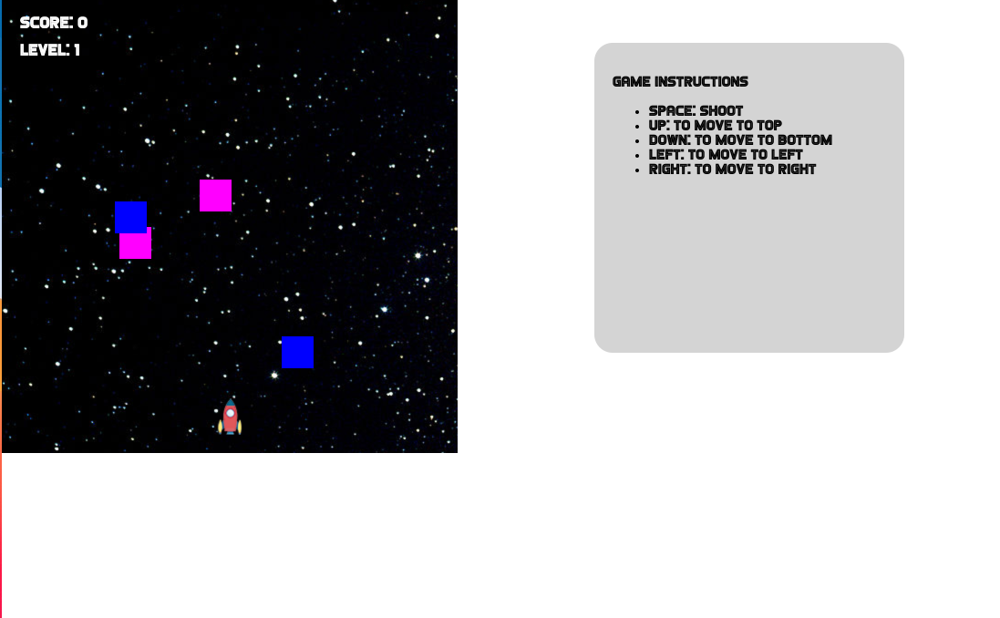

# Test for Frontend Developer position at Harbour.Space

## Run the project

To run this project just run the command below in your shell:

1 - `git clone https://github.com/lucasspi/hs-2d-Shooting-game.git`

2 - `cd hs-2d-Shooting-game`

3 - Double click on `index.html` file

## Access Prototype
You can find the running prototype here: [Access Running Prototype](https://shotting-game.spirandeli.com) or [Here](http://shotting-game.spirandeli.com.s3-website-sa-east-1.amazonaws.com)

